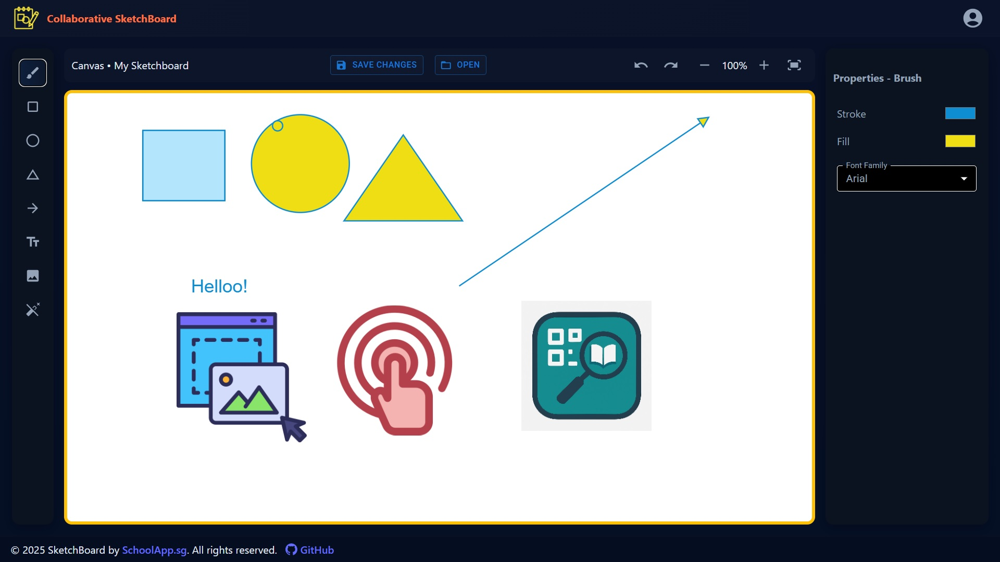

# Sketchboard App

A modern, collaborative sketchboard by **SchoolApp.sg**, built with **React**, **React Konva**, **Material UI**, and **Express.js**. The app allows users to draw, annotate, and brainstorm visually using a variety of tools in a fast, intuitive interface. Hosted on **Digital Ocean** with **PM2** and deployed via **GitHub Actions**, it is developed using modern JavaScript (ES6) and smart workflows to ensure high code quality, performance, and reliability.

- **GitHub Link:** [Collaborative SketchBoard](https://github.com/kennykee/sketchboard)
- **Demo:** [sketchboard.schoolapp.sg](https://sketchboard.schoolapp.sg/)



## Features

- **Drawing Tools:** Brush, Rectangle, Circle, Triangle, Arrow, and Text
- **Eraser:** Remove any object or brush stroke with a click
- **Drag-to-Draw:** Click and drag to create shapes with live preview
- **Text Tool:** Add text with customizable font family and size
- **Undo/Redo:** Step backward and forward through your drawing history
- **Zoom:** Zoom in/out and fit to screen
- **Color & Style:** Choose fill and stroke colors, opacity, and more
- **History:** All actions are undoable and redoable
- **Responsive UI:** Built with Material UI for a clean, modern look

## Getting Started

### Prerequisites

- Node.js (v16+ recommended)
- npm or yarn

### Installation

1. **Clone the repository:**
   ```sh
   git clone https://github.com/kennykee/sketchboard-app.git
   cd sketchboard-app
   ```
2. **Install dependencies:**
   ```sh
   cd client
   npm install
   # or
   yarn install
   ```
3. **Start the development server:**
   ```sh
   npm run dev
   # or
   yarn dev
   ```
   The app will be available at `http://localhost:5173` (or as shown in your terminal).

### Server (Optional)

If you want to use the backend server:

```sh
cd ../server
npm install
npm run dev
```

## 📁 Project Structure

```
client/    # Frontend React app
server/    # Node.js backend (optional)
```

## 📦 Built With

- React
- React Konva
- Material UI (MUI)
- Vite
- Node.js (server)

## 👍 Choice of Technology:

A lean and modern JavaScript stack was selected to maximize efficiency, speed, and business value:

- **Vite (React Frontend)**  
  A next-generation build tool that delivers lightning-fast development with Hot Module Replacement and optimized production builds, ensuring excellent performance and developer experience.

- **Material UI (Design System)**  
  A robust and customizable component library that provides a clean, modern interface out of the box, accelerating UI development while maintaining a professional look and feel.

- **Node.js with Express (Backend)**  
  A lightweight, high-performance backend framework that unifies frontend and backend development in JavaScript. This reduces context switching, streamlines workflows, and enables faster delivery with fewer moving parts.

By consolidating on a single language across the stack, the technology remains simple, efficient, and easy to maintain. This approach minimizes overhead, accelerates delivery, and ensures that the application is built on a proven, future-ready foundation.

## 🧾 License

This project is licensed under the MIT License.  
See the [`LICENSE`](./LICENSE) file for full details.

---

Enjoy sketching! ✏️
